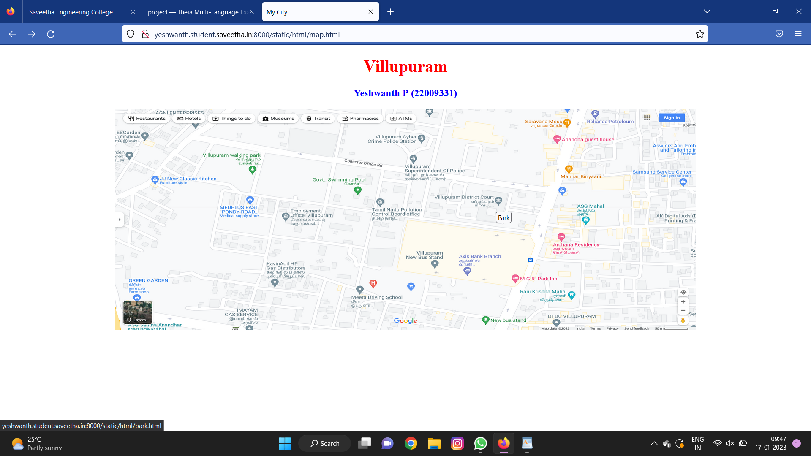
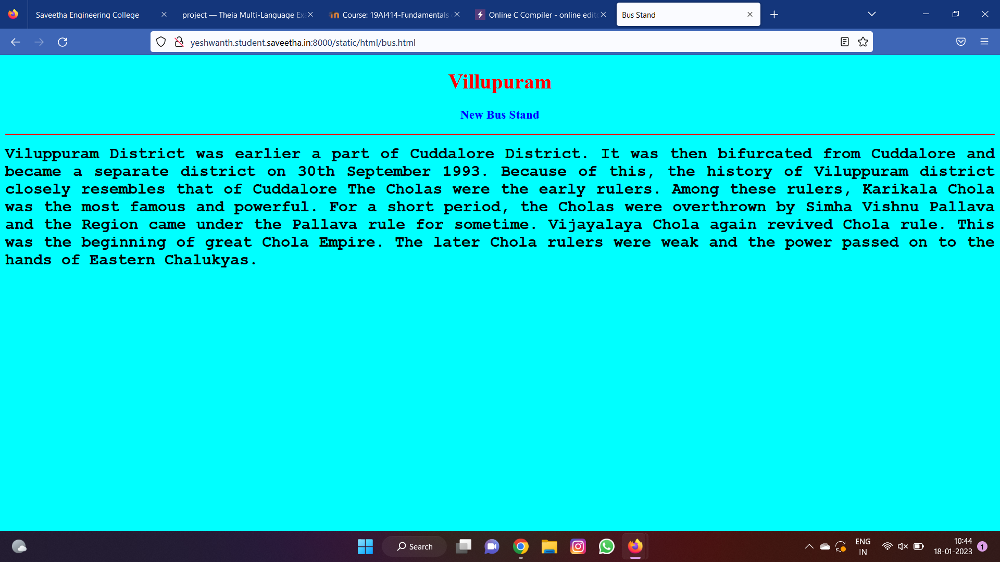
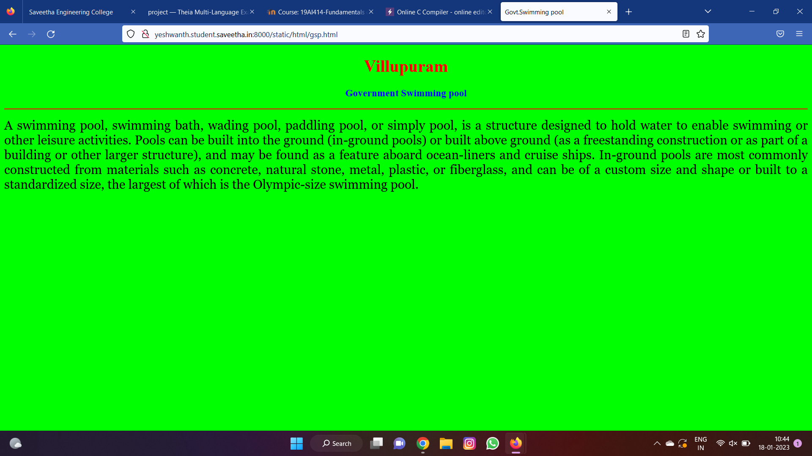
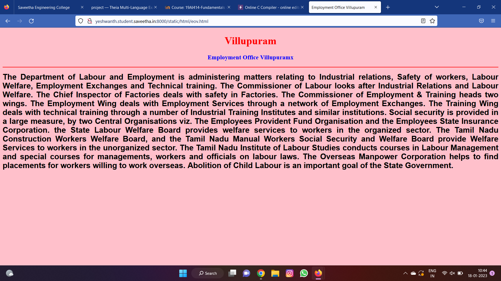
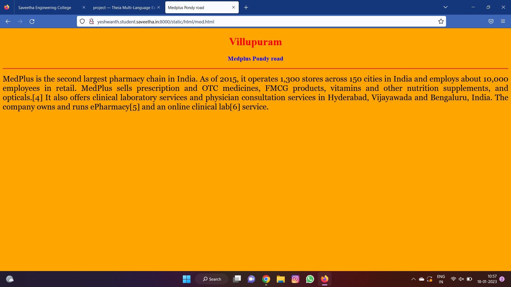
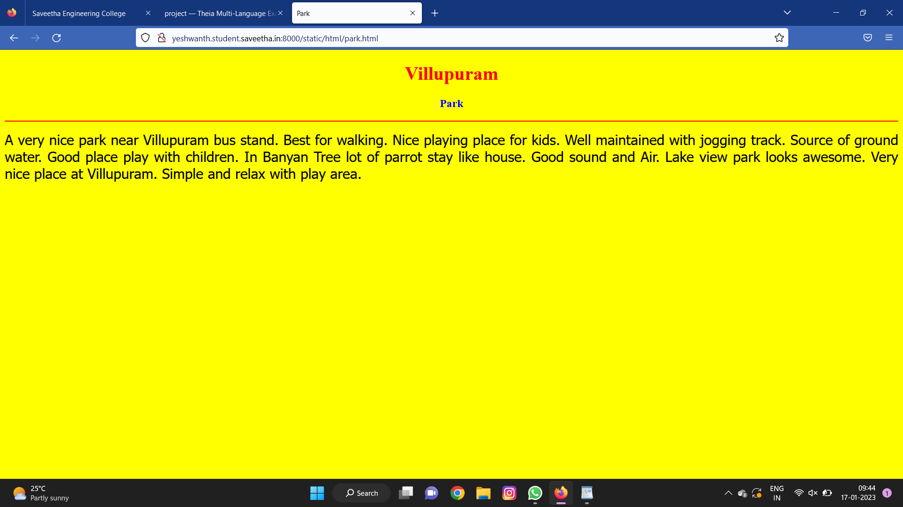
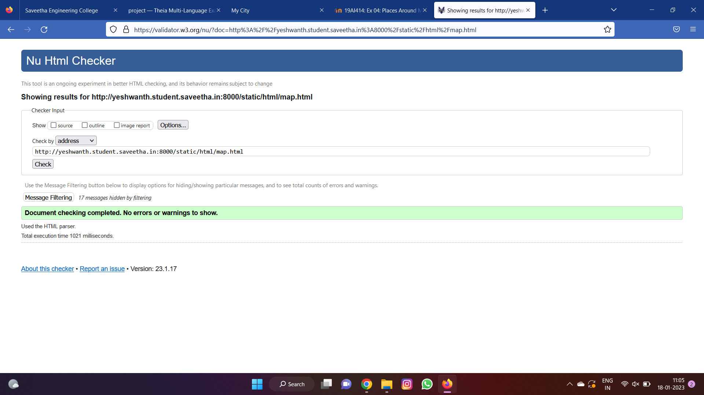

# Places Around Me
## AIM:
To develop a website to display details about the places around my house.

## Design Steps:

### Step 1:
Clone the github repository intro Theia IDE.

### Step 2:
Create a new Django project.

### Step 3:
Write the needed html code.

### Step 4:
Run the Django server and execute the HTML files.

## Code:
```
map.html
<!DOCTYPE html>
<html lang="en">
<head>
<title>My City</title>
</head>
<body>
<h1 align="center">
<font color="red"><b>Villupuram</b></font>
</h1>
<h3 align="center">
<font color="blue"><b> Yeshwanth P (22009331)</b></font>
</h3>
<center>

<map name="MyCity">
<area shape="rectangle" coords="300,150,500,200" href="/static/html/eov.html" title="Employment office Villupuram">
<area shape="rectangle" coords="400,100,500,150" href="/static/html/gsp.html" title="Govt swimming pool">
<area shape="rectangle" coords="250,100,350,150" href="/static/html/med.html" title="Medplus Pondy road">
<area shape="rectangle" coords="490,150,870,320" href="/static/html/bus.html" title="New Bus Stand">
<area shape="rectangle" coords="200,150,300,200" href="/static/html/park.html" title="Park">
</map>
</center>
</body>
</html>

bus.html
<!DOCTYPE html>
<html lang="en">
<head>
<title>Bus Stand</title>
</head>
<body bgcolor="cyan">
<h1 align="center">
<font color="red"><b>Villupuram</b></font>
</h1>
<h3 align="center">
<font color="blue"><b>New Bus Stand</b></font>
</h3>
<hr size="3" color="red">
<p align="justify">
<font face="Courier New" size="5">
<b>
Viluppuram District was earlier a part of Cuddalore District. It was then 
bifurcated from Cuddalore and became a separate district on 30th September 
1993. Because of this, the history of Viluppuram district closely resembles 
that of Cuddalore The Cholas were the early rulers. Among these rulers, Karikala 
Chola was the most famous and powerful. For a short period, the Cholas were 
overthrown by Simha Vishnu Pallava and the Region came under the Pallava rule 
for sometime. Vijayalaya Chola again revived Chola rule. This was the beginning 
of great Chola Empire. The later Chola rulers were weak and the power passed on to
the hands of Eastern Chalukyas.</b>
</font>
</p>
</body>
</html>

park.html
<!DOCTYPE html>
<html lang="en">
<head>
<title>Park</title>
</head>
<body bgcolor="yellow">
<h1 align="center">
<font color="red"><b>Villupuram</b></font>
</h1>
<h3 align="center">
<font color="blue"><b>Park</b></font>
</h3>
<hr size="3" color="red">
<p align="justify">
<font face="Tahoma" size="5">
A very nice park near Villupuram bus stand. Best for walking. Nice playing place for kids.
Well maintained with jogging track. Source of ground water.
Good place play with children.  In Banyan Tree lot of parrot stay like house. 
Good sound and Air. Lake view park looks awesome.
Very nice place at Villupuram.
Simple and relax with play area.
</font>
</p>
</body>
</html>

eov.html
<!DOCTYPE html>
<html lang="en">
<head>
<title>Employment Office Villupuram</title>
</head>
<body bgcolor="pink">
<h1 align="center">
<font color="red"><b>Villupuram</b></font>
</h1>
<h3 align="center">
<font color="blue"><b>Employment Office Villupuramx</b></font>
</h3>
<hr size="3" color="red">
<p align="justify">
<font face="Arial" size="5">
<b>
The Department of Labour and Employment is administering matters relating to 
Industrial relations, Safety of workers, Labour Welfare, Employment Exchanges 
and Technical training. The Commissioner of Labour looks after Industrial Relations 
and Labour Welfare. The Chief Inspector of Factories deals with safety in Factories. 
The Commissioner of Employment & Training heads two wings. The Employment Wing deals
with Employment Services through a network of Employment Exchanges. The Training Wing 
deals with technical training through a number of Industrial Training Institutes and 
similar institutions. Social security is provided in a large measure, by two Central 
Organisations viz. The Employees Provident Fund Organisation and the Employees State 
Insurance Corporation. the State Labour Welfare Board provides welfare services to workers 
in the organized sector. The Tamil Nadu Construction Workers Welfare Board, and the Tamil Nadu 
Manual Workers Social Security and Welfare Board provide Welfare Services to workers in the 
unorganized sector. The Tamil Nadu Institute of Labour Studies conducts courses in Labour 
Management and special courses for managements, workers and officials on labour laws. 
The Overseas Manpower Corporation helps to find placements for workers willing to work overseas. 
Abolition of Child Labour is an important goal of the State Government. </b>
</font>
</p>
</body>
</html>

gsp.html
<!DOCTYPE html>
<html lang="en">
<head>
<title>Govt.Swimming pool</title>
</head>
<body bgcolor="lime">
<h1 align="center">
<font color="red"><b>Villupuram</b></font>
</h1>
<h3 align="center">
<font color="blue"><b>Government Swimming pool</b></font>
</h3>
<hr size="3" color="red">
<p align="justify">
<font face="Georgia" size="5">
 A swimming pool, swimming bath, wading pool, paddling pool, or simply pool,
 is a structure designed to hold water to enable swimming or other leisure activities.
 Pools can be built into the ground (in-ground pools) or built above ground 
 (as a freestanding construction or as part of a building or other larger structure), 
 and may be found as a feature aboard ocean-liners and cruise ships. In-ground pools 
 are most commonly constructed from materials such as concrete, natural stone, metal, 
 plastic, or fiberglass, and can be of a custom size and shape or built to a standardized 
 size, the largest of which is the Olympic-size swimming pool. </font>
</p>
</body>
</html>

med.html
<!DOCTYPE html>
<html lang="en">
<head>
<title>Medplus Pondy road</title>
</head>
<body bgcolor="orange">
<h1 align="center">
<font color="red"><b>Villupuram</b></font>
</h1>
<h3 align="center">
<font color="blue"><b>Medplus Pondy road</b></font>
</h3>
<hr size="3" color="red">
<p align="justify">
<font face="Georgia" size="5">
MedPlus is the second largest pharmacy chain in India. As of 2015, 
it operates 1,300 stores across 150 cities in India and employs about 10,000 employees in retail.

MedPlus sells prescription and OTC medicines, FMCG products, vitamins and other nutrition supplements, 
and opticals.[4] It also offers clinical laboratory services and physician consultation services in Hyderabad, Vijayawada and Bengaluru, India. The company owns and runs ePharmacy[5] and an online clinical lab[6] service.
</font>
</p>
</body>
</html>
```

## Output:












## HTML Validator


## Result:
The program fpr implementing image map is executed successfully